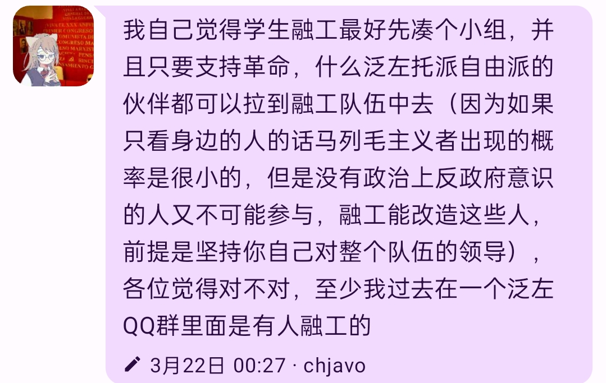
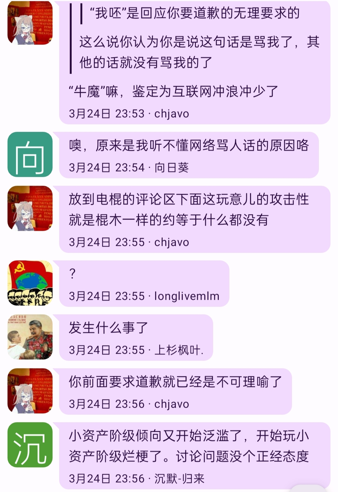

# 反面教员发言截图：

# 批判：
说这个话的人，似乎是把融工当作什么游戏了，带着一堆狐朋狗友就开开心心地去融工了，那么自然是什么人都可以进，“和你关系特别特别好也可以放进去”、“什么泛左托派自由派的伙伴都可以拉到融工队伍中去”。表面上是团结了一大堆人，朋友多多的，其实拉拢到的这些人根本不能称为朋友。这样做的后果，只会导致建立起来的工人组织内充斥着各种反动思想，各路牛鬼蛇神与马克思主义者争夺领导权，这样一个泛左大调和的融工组织，不能起到在工人中宣传的作用，反而是把各种反动政治理论灌输到工人当中，将工人运动引上邪路。

姑且不论自由派和修正主义分子会不会愿意与工人同吃同住同劳动，某人口中说的自由派和修正主义分子“支持革命”，恐怕不是从现实中调查得到的，而是出于完全的臆想。这些人实际上是并不支持无产阶级的革命，只是想要消灭现在的中修政府而后建立新的资产阶级专政政府，自己成为新的压迫者。某人仅仅看到了表面，说这些有“政治意识”、反对中修的人就是需要优先团结的对象，说要先团结这些人再去工人中做宣传。却把工人说成是“不熟”的，既然和工人阶级都不熟悉，那么这位先生还干什么革命呢？

本文的作者也是刚从学生中脱离出来成为工人不久，在我还是学生的时候，身边也不乏一些口头上反对中修的自由派和修正主义分子，但是他们无一例外都在毕业后走向了当工贵、考研、考公的道路，没有一个愿意成为工人的。如果按某人的说法，这些“有政治意识”的旧朋友是先进的，那么我在工厂里接触到的工人，却成了落后的吗？的确，这些工人确实不懂得太多政治的理论，他们平时会聊一些如亲戚买到烂尾楼、孩子上学被势力眼老师针对的事情，在某些人眼里，这大概就是没意思的日子人吧！但是这些工人在这些日常聊天中对中修进行的揭露，都是真实地来源于他们所受到的压迫和剥削，来源于他们的生活，这和学生中只会含两句“自由！”口号的人要先进的多。

某人接着说到：
> 有自由派倾向的学生绝大多数支持抽象的“全民的自由”，而在资产阶级专政和垄断资产阶级对无产阶级、小资产阶级的普遍剥削下，在他们把那些垄断资产阶级作为敌人的情况下，这种“全民的自由”也只能是排除那些大资产阶级的，而且实际上是更贴近于无产阶级的
> 觉得中国“独裁统治”，人民没有“自由”，人们被剥削是因为政治上不自由，要起来争取“自由”的
> 觉得谁不行后面就可以把那个人驱逐出去

这无非是孟什维克如出一辙的右倾机会主义观点，孟什维克就曾经认为，为了推翻沙皇，立宪民主党、社会革命党这些资产阶级政党都是可以团结的。学生中能够接受自由派观点的本来就是较为落后的，某人却开始为他们鼓吹，说他们讲的这个自由是无产阶级的。这些落后学生的进步性，大概只存在于某人的臆想中，这些落后学生讲的“自由”，恐怕并不是因为认识到了无产阶级的痛苦，而是接受了各种自觉自由派分子如王小波等人的宣传，才会有超阶级的“自由”观点。这种抹杀阶级斗争的观点不就是代表了私人垄断资产阶级的利益吗？推翻了中修，然后呢？自由派上台，就有自由了吗？他们讲的自由就是私人垄断资产阶级的自由而非无产阶级的，而某人千方百计为这些支持自由派的落后群众辩护，不知道是什么居心。

无产阶级革命的前提是坚持无产阶级的领导，马克思主义去融工，优先需要团结的是工人当中的先进分子，既然这样，把这些“有政治意识”的落后的学生朋友带在身边，就是完全多余的，并且是有害的，某人说得简单，觉得谁不行了，可以把他们驱逐出去。这个话我觉得非常眼熟，孟什维克分子就说，如果立宪民主党反对无产阶级专政，那么可以随时把他们驱逐出去，而孟什维克到底有没有实现他们所说的“驱逐出去”，任何一个了解俄国革命历史的同志都知道了这个结局。

带着一大群牛鬼蛇神去融工，只会造成融工队伍中马克思主义者的力量缩小，而各种机会主义的力量很强大，真的发生路线斗争时，就不是马克思主义者驱逐他们，而是他们驱逐马克思主义者了。正如孟什维克的路线，最终产生了一个与无产阶级革命背道而驰的资产阶级临时政府。某人的孟什维克融工路线的结局也是这样，最终在工厂里产生了一个持续给工人宣传反动理论的反动组织，这样的路线，不会对革命有任何的贡献，反而是产生极大的危害。

某人为了反对我说的要优先团结工人中的先进分子，而非学生中的旧朋友，接着抛出了这么两句话：
> 融工是系统工程，一个人做不了那么多事情
> 没有旧朋友帮忙交新朋友的过程也会很缓慢

这两句话只能暴露某人头脑中群众反动论的观点，他把工人放得比这些学生中的落后分子更低，什么都想到旧友，却不想着去认识新朋友，是自己的宣传策略不行，却觉得是群众的问题，这里我打算引用红花同志之前写过的一篇文章，叫《马克思主义可以与自由派结为联盟吗？》，其中写到：

> 与资产阶级之间相反的是，整个资产阶级和无产阶级矛盾是你死我活的对抗性矛盾，必须通过革命才能够得到解决。尤其是当无产阶级革命兴起的时候，这就不能不把那些私人垄断资本剥削下的工人给争取过来，就不能不发动这些工人来反抗中小资本的剥削，就不能不和私人资本进行斗争和矛盾。我们首先，是应当团结我们真正同志，其次再团结朋友。可是，为了“团结朋友”，而不顾我们同志的感受。如果这样做了就是忽视了广大被私人垄断资本压迫的工人的利益，是对他们的背叛，是跟随在私人垄断资产阶级屁股后面当他们的随从了，是中国的孟什维克。私人资本也不是傻子，不会面对无产阶级革命和无产阶级一致，必然要寻求更有力量的资产阶级的庇护和帮助，这一时期整个资产阶级的利益都是一致的，彼此之间的相互的冲突则居于次要方面，和无产阶级的斗争成为了资产阶级的主要方面。

而某人的路线正是“为了团结朋友，而不顾同志感受”，这种融工路线上的孟什维克，与马克思主义是背道而驰的，任何革命的同志都需要坚决反对这种孟什维克主义的融工路线。

# 后续：
此人在被批判后拒绝认错，且用乐子人语言攻击

其还有很多机会主义逆天言论，但是考虑到他在另一个群聊里的影响，我们暂未将其封禁，不过他的各种机会主义言论已经被群众广泛批判，他对工农解放社以及伐修社等战友组织的攻击污蔑也被记录，如果其继续死不悔改，我们将会放出这些记录。