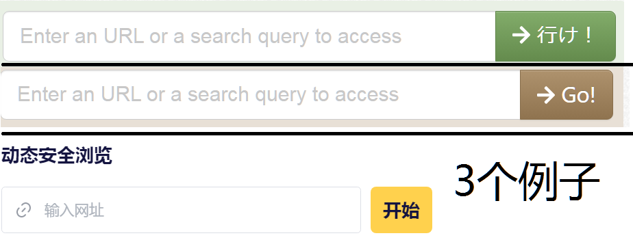

# 网络安全入门

本文适用于急需网络安全保护自己的同志。力求简介快速，对原因原理的解释难以详尽。

> 事实上，本手册并不是《网络安全进阶》的铺垫，相反，本文是于其之后写的。

## 简论

互联网访问就像送信。送信有三者参与：你（客户端），对面（服务端），邮差（中间人）。信封是无法被除了对面以外的人打开的。但是信封上写了发件人地址（你的IP地址），收件人地址（对面的IP地址），收件人名称（网站名）等。

中修的国家机器控制了邮差。所以邮差会根据收件人地址和收件人名称丢弃信件，实现封锁。为了解决这一问题。我们把一封信连着信封塞到另一封信里，发给代理（代理服务器）。

单纯把一封信塞到另一封里特征过于明显，可能被中修发现并封锁。所以有一些技术手段来避免中修发现

最终结果是：

> 中修啥也不知道。
> 代理服务器知道你访问的网站和你的ip。
> 网站知道你访问的内容，发的信息，但不知道你的ip。

还有一些技术手段减少泄漏的信息，但是这里不多讲。

## 祸从口出

我们知道墙内是实名的，你说啥警察都知道你是谁住在哪里。因此不要和墙内身份关联。

首先，username（用户名）不要和墙内有任何管理，随便挑一个正面的英文单词，或者中文词组转拼音。如Advance，或者jinhou。个人建议避免中文用户名。

然后，不要讲自己的墙内身份。如果有人问你哪来的，最多告诉他平台，如qq来的，b站来的。对同志的信任需要时间。

还有，不要截取墙内平台的图片，或者转发墙内平台的言论。

最后，密码不要太弱，比如123456。至少大小写字母加数字。如GEPH1893xjp

嘴巴关严实了，信写得没漏洞了，我们来确保网络不泄漏，送信安全。

接下来我们就需要搞一个代理了。

## 网页版紧急代理软件

有个网站叫croxyproxy，提供了免费的网页代理。有广告，部分靠广告盈利，不知道会不会主动窃取信息。但是拿来下载点东西是可以的。

由于这个网站也经常被墙，所以有些就不能用了。但是他们搞了一个又一个镜像。

列出一些2025.03.22能用的：

+ https://proxyorb.com/zh-CN
+ https://croxyproxy.app/
+ https://64.227.120.231/_ja/
+ https://proxycroxy.io/
+ https://www.lablancer.com/

怎么搞呢，bing搜索web pro xy 即可（为什么不是web proxy？因为proxy是敏感词，遂添加空格）。

https://cn.bing.com/search?q=web%20pro%20xy&qs=ds&form=QBRE

这个空格把proxy分开就行，似乎空格位置不一样结果还不一样。。。

基本上都能找到这样一个框

左边输入框输入网址，点右边按钮就可以翻墙加载了。

## Windows紧急用代理软件

由maoist2009通知编写的TlsFragment Windows客户端。

解压后运行`安装`即可运行，之后使用使用`运行`即可。

下载链接：

+ [Github Release](https://github.com/maoist2009/TlsFragment_Windows/releases/download/V1.0.0/dist.zip)
+ [本站codeberg版本](https://mlmistrevolutionagain.codeberg.page/TlsFragment_Win.zip)
+ [本站CF pages版本](https://mlmistrevolutionagain.pages.dev/TlsFragment_Win.zip)

## 推荐代理软件

### 迷雾通

[官网](https://geph.io/)；[官方安卓下载](https://dl.geph.io/geph-releases/android-stable/4.99.32/geph-android.apk)；[官方Windows下载](https://dl.geph.io/geph-releases/windows-stable/4.99.32/geph-windows-setup.exe)；[官方GNU/Linux下载](https://dl.geph.io/geph-releases/linux-stable/4.99.32/Geph-x86_64.flatpak)

**安卓**镜像以下链接一个一个尝试下载：

+ https://github.yongyong.online/https://github.com/maoist2009/AndroifFrag/releases/download/0.-1/geph-android.apk
+ https://ghfast.top/https://github.com/maoist2009/AndroifFrag/releases/download/0.-1/geph-android.apk
+ https://gh-proxy.net/https://github.com/maoist2009/AndroifFrag/releases/download/0.-1/geph-android.apk
+ https://wget.la/https://github.com/maoist2009/AndroifFrag/releases/download/0.-1/geph-android.apk
+ https://github.boki.moe/https://github.com/maoist2009/AndroifFrag/releases/download/0.-1/geph-android.apk
+ https://gh.ddlc.top/https://github.com/maoist2009/AndroifFrag/releases/download/0.-1/geph-android.apk

下载慢正常，等就行

注意！！迷雾通和一些xmpp服务器不兼容！若使用迷雾通翻墙，注册时建议使用`conversations.im`服务器注册。

中文界面，比较好操作。

注册新账户，人机验证码先要点注册才会显示。

注册成功之后登陆，就可以连接了。

### proton VPN

[官网](https://protonvpn.com/)；[官方Win链接](https://protonvpn.com/download-windows)（需要自己选择系统，一般是x64架构）；[官方安卓Fdroid](https://f-droid.org/packages/ch.protonvpn.android/)

**安卓**镜像以下链接一个一个尝试下载：+ https://gh.ddlc.top/https://github.com/ProtonVPN/android-app/releases/download/5.9.59.0/ProtonVPN-5.9.59.0.605095900.-production-vanilla-direct-release.apk

+ https://ghproxy.1888866.xyz/https://github.com/ProtonVPN/android-app/releases/download/5.9.59.0/ProtonVPN-5.9.59.0.605095900.-production-vanilla-direct-release.apk
+ https://github.moeyy.xyz/https://github.com/ProtonVPN/android-app/releases/download/5.9.59.0/ProtonVPN-5.9.59.0.605095900.-production-vanilla-direct-release.apk
+ https://ghproxy.net/https://github.com/ProtonVPN/android-app/releases/download/5.9.59.0/ProtonVPN-5.9.59.0.605095900.-production-vanilla-direct-release.apk
+ https://github.com/ProtonVPN/android-app/releases/download/5.9.59.0/ProtonVPN-5.9.59.0.605095900.-production-vanilla-direct-release.apk

之后

1. 点create an accout（创建账户）
2. Get a new encrypted email accout（获取proton账户）
   你也可以用你自己的邮箱，但没有专业知识不推荐，中国人用的大部分邮箱并不安全，而且proton mail一定意义上其实是后续必要的。
3. 填写username，domain为proton.me
4. 设置密码，上下输入一样的，确认没有打错
5. 让你输入recovery method（重置办法）,点skip
6. human verifaction（人机验证），直接完成拼图即可。
7. 等一会儿
8. Get started（开始）
9. Not now（现在不购买plus）
10. 然后底下操作栏settings，protocol选Stealth.
11. 回到主界面connect即可连接

