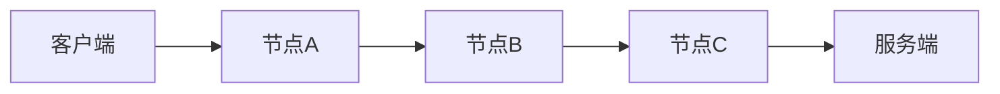
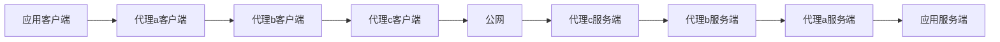

# 互联网基础

## 序言：审查机器
GFW，估计是目田起的，全称GreatFireWall，指的是中国的国际联网审查机器，但也成约定俗成的名字了。

虽然gfw是wall，但是自由派往往称其为审查机器（censor）。

这是因为，反动政府无法完全阻断互联网，其作为第三次产业革命的产物早已深入社会生产的各个部分。这就像封建统治者不能禁止农民阶级拥有锄头一样。

因此，其需要识别流量，这就需要流量本身有特征，如没有加密，大小明显等。与此同时，审查机器所面对的是国际出入口每秒TB级别的出入数据（也就是几千部电影的大小），其必须能快速地处理数据流。这正是反动政府面对人民群众的劣势。反动政府的机器再好，也多不过人民群众手中设备的总和，只不过人民群众还没有团结起来罢了。

进一步下面第二章会介绍

## 各级网络协议
网络协议大致分为五层，就好像从物理到化学到生物学到社会学一样，每一层都有自己的规律，又为上一层所承载。
1. 为了讲清楚审查的过程，我会重点讲讲过程中泄露了哪些信息。
2. 为了规避审查，我们需要改变包的内容，所以需要知道我们能否有权限对这一层数据进行更改

### 数据链路层
这一层底下就是物理信号。该层搭建了一个局部的网络。

该层常见协议为以太网协议，Wi-Fi协议（无线网络），这个网络中机器的编号叫mac号。

在这个网络中，所有机器互相连接。类比邮件递送过程，这就像地方邮局，记录下了附近邮局和住户的实际地址，比如说某某路多少弄几号。每个数据包[^1]有一个源mac和目标mac，比方说源mac是住户，目标mac是地方邮局。

[^1]: 可以理解成每个快递包裹，但是我们没有全球地图，只能和几个附近直接相连的个体对话。

这一层是一个叫做网卡的硬件负责的，即使是操作系统[^2]也无法自由控制[^3]。但是，特别的，mac号是由操作系统可以控制的。

[^2]: 也指有高权限的应用，所谓高权限权限如windows的admin权限，linux的root权限。

[^3]: 自由控制只能自由构造包裹，这一层来讲，比如说能不写mac号，或者在两个mac号中间插入别的东西，或把mac号放在数据后头等。

每台机器的mac号由网卡决定，每个网卡的默认mac号表示了厂商名，批次名和编号。每台设备默认mac号不一致，所以会被用来标识设备。当然，网卡提供操作修改自己mac号。

### 网络层

这一层定义了一个互联的网络最大的ip网络就是全球互联网（公网），因为网络中参与者太多，很多时候这些人在一个小ip网络（局域网）中，共用一个上一级ip网络身份，甚至局域网也可以嵌套。

常见的协议有ipv4协议和ipv6协议。ipv6是因为ipv4地址不够用而提出的。你可以认为ip是一个家庭，共用一个编号（收件地址），如中南海习家。

显然，ip是被泄露了的。因此，审查机器可以阻止向特定的收件人送信。

这种封锁手段就叫**ip封锁**

我们知道数据链路层负责在直接相连的设备间发送数据包，从一个节点到下一个节点。**为数据包选择一条从源到目的地的路径**这一任务是由网络层完成的。

具体如何规划，基本上是由BGP协议完成的。BGP协议用于在自治系统[^4]之间交换IP信息，搭建地图，帮助导航。

这一层**基本由操作系统控制**。

[^4]: 由一个或多个网络运营商管理的一组网络，这些网络在内部使用相同的路由策略，对外表现为一个统一的整体。每个自治系统都有一个唯一的编号，称为自治系统号（ASN）。

通过BGP协议，恶意地将IP访问路线导航到错误的地址，就好像把车子导航到荒郊野岭一样。通过这种方式完成的**IP封锁**，称作为**IP黑洞**。

为了防止路由错误导致的数据包无限循环，引入了一个叫TTL（Time To Live）的东西。每台机器收到数据包后，就把TTL减去1，转发给下一台。如果TTL为0，就直接丢弃这个数据包。TTL可用于计算数据包经过了多少个服务器。

**TTL，目标IP可由应用控制。**

### 传输层

传输层首先定义了一个源端口和目标端口，可以想象成一个端口是一个任务编号，因为计算机同时要处理很多事情收发很多东西，所以需要端口区分。

如果只是加上端口，那么就是UDP协议。另外一个常见协议是TCP协议。

具体来说，在古早的网络环境中，数据包很容易因为各种原因（早期网络不大稳定）丢失。那么，如何确保数据包完整，按序送达呢？于是就提出了TCP协议。

**传输层由操作系统控制**。但是**端口可由应用控制**。

> TCP这里产生了一个概念，叫做连接。以太网，IP协议，UDP是无连接的。
> TCP在通信前需要先建立连接，确保数据可靠、有序地传输。TCP连接前有握手有3步，早期TLS协议（下一部分）有4步，通讯前握手大大加大了延迟。
> 为了解决这个问题，Google提出了quic协议，相当于把TCP，TLS组合起来优化。然而，由于资本主义下生产的无序性，大部分路由器只支持TCP和UDP协议，难以重新定义传输层协议，所以其使用UDP作为传输层，自己再来维护连接。

> 由于UDP

### 加密层

为了保证通讯内容不被窃听篡改，有了一层加密层。这一层的协议叫TLS/SSL。最新的协议为TLS1.3，基本已经普及。

在此之前，一切信息都是明文的，在此之后，一切信息都是加密的。然而，TLS在握手过程中有一个明文的字段，sni。sni泄露了你访问的网站，如`www.xmpp.jp`，但是你具体访问的内容是加密的

GFW根据明文的sni进行封锁。封锁具体方法利用了TCP协议中的一个特定规则，可以发送一种叫RST的包立即中断连接。由于TCP协议没有被加密，故GFW可以轻易伪造RST包。这种封锁方式称之为sni阻断或者TCP重置。

**加密层由应用控制，常用一个叫做OpenSSL的软件库。**

> **加密与哈希**
> 为了确保信息的私密或完整传递，人们提出了一些算法，
> 加密分为两大类，加密与哈希。加密的目的是防止信息被第三方偷窥获取，哈希则是防止信息被篡改，或者确认发件人。加密较好理解，下面讲讲哈希。
> 如果我们想判断两个人是否是一个，但见不到完整的人，怎么办？比较常见的方法有指纹，每个人指纹都不相同。如果人少，甚至可以用生日判断。通常认为，若哈希后信息有$n$种中，则大概能容纳后$\sqrt n$种原信息以保证没有两者有相同哈希值。

这被称为生日悖论，即23个人中有很大概率生日相同。

> **对称与非对称**
> 假如AB之间要加密通信，必然有一个密钥密钥加密，然后B用密钥解密，反之亦然。
> 比方说A给B发一个数，为确保安全，A会将致加上密钥，B收到后减去密钥，就完成了加密通信。
> 但怎么安全传递此密钥呢?
> 上面的过程中，加密解密用的密明是相同的，故称对称加密。为了破解这个加密难题有一类非对称的加密，好比你一把挂锁，任何人都能把锁关上，但只有钥匙能将其打开。
> 同理，非对称加密利用数学中一些不可逆操作，使信息只用公钥，即公开的密钥加密，再用私钥即私有的钥匙的解密。也有私加公解的。对于哈希也是，有公钥计算，私钥校验，也有私计公校。

> **证书链**
> 想象只有非对称加密，并不能解决问题。你会发现对方能做的，中间人同样能做，你无法保证是对方。光靠教学的推演，解决不了物质世界的问题。
> 解决办法是证书链。首先有一匹被“公共新人”的概证B机构，私计公校，验证下一级证书机构，其用私计公校驻证不级……直到网站，网站再私计公校特定内容（每次连接不一样），确认自己身份。
> 导然根证书掌握在资产阶级手中，但对中国的革命者有一个好消息，尽管曾经中修有根证书，后因其行为不端被其余帝国吊销了，因此中修不大可能进行中间人攻击。

### 应用层

应用层，就是具体的信息内容了。为了区分同一服务器上的不同网站，一般有一个Host字段，记录了你访问的网站。

常见的协议有HTTP（网站访问），WebSocket（SOCK），FTP（文件共享）等等。

为了强调使用了TLS加密，后面加个S，如HTTPS，SOCKS等。

> **关于Sni与Host，域前置**
> 在早期的互联网中，并没有域名一事，直接访问IP，想象你并不访问mlmistrevolutionagain.pages.dev，而不是(英文:马列毛主者继续革命)，而是104.18.3.26，那显然不太好记。
> 为了解决比问题，域名作为的别名出现了。此时也只是IP的小名而已。
> 再后来，网站越来越多，公网IP就那么及个，不够了，便提出了虚拟生机，也就是HTTP中的Host字段。（当时还没有TLS）给服务器用于决定将流量交个给哪个网站的处理
> 域名越来越多，量变引起质变，一个IP可以在上万个网站，域名也早不是小明了了，相反，将IP比作楼，域名作为住户可能更合适。每个住户相互独立。
> TLS出现后，既然域名像住户，相互独立，证书也相互独立。但是，TLS未建立，无HTTP包，自然无Host字段，于是TLS第一个握手包仅有了明友的sni字段。
>这个Sni，也即GFW阻断HTTPS连接依靠的，有趣的是当HTTPS普及刚开始一段时间，GFW手足无措，但自从Mozilla发表了对sni泄露隐私的论文后不久，GFW便开始用sni识别连接。
> 正因为一开始服务器使用Host区分域名，sni仅用于决策发哪一张TLS证书，因此不发sni连接（也可以发假的Sni，反正是一个服务器，不导致中间人窃听或者篡改），也能正常通信。此即域前置。所以服务器天然支持域前置，不过有部分CDN出于安全考虑或者迫于压力限制了域前置。

### 应用层之上

应用层之上，基本和网络没什么事情了。再就是具体网站的行为了。

附上一张图


## 翻墙

### 根本原理：流量转发

为了避开GFW的审查，最简单的思路是流量转发，就好像如果A不能直接写给B，就写信给C，内容是：

```plaintext
请转发给B
原内容
```
#### 困难一：流量识别.

显然，反动政府会想尽一切办法阻止我们绕过审查。然而，其不敢破坏正常流量的通行，因此，其会尝试寻找翻墙流量的特征。

以上面A发给C的信为例，每次都说：“请转发给…”特征十分明显。

特征并不局限于内容，甚至每个包的大小也是特征。

> 有的朋友可能说：“既然TLS可以加密内容何不加密信件内容呢?”但要注意，往往转发的内容也是TLS加密的。这叫“TLS in TLS”。
> 这里介绍一点，TLS握手包的大小是明显的，而加密基本不改变包大小，因此，“TLSinTLS”的前几个包大小规律明显，已被GFW识别。

为了防止流量识别，就需要设计协议。这里的协议就同之前各层的协议一样，规定了交流方式。

一般翻墙协议建立在TCP上，协议规定了客户端与代理服务器如何交流。

一些常见的目前可用开源协议为：VMESS，VLESS，Trojan，Stealth（Proton VPN），niaucchi4（迷雾通）

也有一些已被识别的切记如HTTP5，Sock(S)，OpenVPN，wireguard，masque等。

#### 困难二：出口IP

资产阶级又有一项臭名昭著的法权：版权。一部电影即使在一国家内购买，换个地方又要交一笔钱。

那么这种国别识别在网络中如何实现？靠的是IP地址。

以不少小资产阶级喜欢看的NetFlix为例，其只向特定地区提供服务，实际上就只有特定范围的IP能使用服务。

既然流量是由代理转发的，那么自然服务器获得的IP也是代理的，一般判断的国别也是代理的。

> 为什么说是一般呢?因而有的网站试图屏蔽代理以保护版权等，而有的代理用多了，会被标记为代理，然后被封锁。

对于无产阶级革命家，出口IP带来的问题主要在注册一些私有平台，如Google，Telegram。Google手机号注册疑似要求手机号与IP同国家，Telgram如果一个帐号IP多次改变（想象一个人一会儿在美国，一会儿去了印度尼西亚。)，可能导致封号。一些国内服务限制外国人使用。同志们接码时需注意。

当然，**自由平台不大会做这类限制**。

## 中修的GFW

这一章我们讲讲GFW的位置，和中修其他国家机器针对翻墙一事的行为。但要注意，我们无人参与了GFW建设，一切只是根据现象理性推测。

### GFW的位置

GFW有省墙和出口墙，有各自的封锁策略和任务，一般认为电信，移动，联通，教育网[^4]相对独独立
[^4]: 中修大部分学校的网络

#### 出口墙

在北上广的互联网国际出口，被认为有GFW出口墙。其负责IP黑洞，封锁一部分域名。

#### 省墙

一般认为各省甚至地级市的封锁互相独立。

省墙进行DNS污染，封锁更多域名，封锁一部分IP。

由于少教民族地区民族矛盾，一般此处封锁更严重。

### GFW的连接方式

GFW的计算机一般认为主要是并联[^5]。但IP封锁之类（非黑洞，主要是恶意丢包）似乎只能用串联解释。
[^5]: 初中物理知识，或可见青年自学丛书。你可以想象串联是在水管上直接建立大坝检查，并联是只有一部分水接受检查，其他直接流出。注意我们检查的是有没有水（对应计算机中0和1），所以并联仍然可以得到完整数据。

### 井GFW策略

很有意思，被识别的翻墙有的时候不被立即封锁，而是秋后喝茶。

一般中修敏感时期，如两会，六四，国庆封锁变严。但显然对未识别协议无影响。

似乎一个IP流量大了（如共用节点）会被重点关注，可能会被人工复查决定是否封锁。

封锁大多发生在白天，大概有流氓无产者，反动军警参与识别。

小部分北航，哈工大学生被认为是GFW建设主力军。

### 反动军警抓人手段

一般认为晶格只是缺钱了，抓几个翻强的凑业绩搞钱。少数突出者可能被官僚资产阶级下令特别关照。

比如著名目田技术人员编程随想，应该被不通缉令了。但一般认为他并未倒在GFW，其死因大概为为09年左右注册微博等同名帐号。相反，目田甚至并未报告根据IP抓人记录。

看了这么久，给大家讲个“笑话”。

> 中修所谓翻端违法的唯一相关法务为《计算机信息网络国际联网管理暂行规定》中，“任何单位和个人不得自行建立或者使用其他信道进行国际联网。
> 但信道的解释多是传播介质，如光缆，无线电。尽管使用代理，流量里还是从电信，移动，联通三大运营处由北上广国际出口海底光缆出国，并无建立所谓信道。毕竟我们也天财力私拉海底光缆或者发射同步卫星….…
> 然而，在资产阶级国家机等面前无产者并没有解释的权利，也无一丁点权力。

## 常见翻墙软件介绍。

具体界面操作此处略去

### V2Ray， Singbox.

这两个是主流的机场客户端。（往往其代理服务器也是这个软件，此外不深入）

+ 所谓节点，可以认为是一份这类软件的配置，告诉软件如何使用机场的代理服务
+ 所谓机场，就是用一些服务器（通常是买的）搭建了一匹节点用于出售。

这类软件是开源的，但机场主人不排除是晶哥。当然，此时泄漏的信息**同直连相同**。

### Proton VPN，Geph（迷雾通）

这是两个推荐的与中修无肉身关系（指作者中国人）的自由VPN，官方提供免费服务，速度适中，上XMPP，看网页（非视频）不成问题。

同时，这两项VPN也去打隐私，甚至采用了一些技术手段一定程度上保证这一点。

需要注意，Proton VPN使用时最好确保选择Stealth协议，默认WireGuard协议特征明显，极易被封锁。

### 小牛VPN，老王VPN等

不开源，极不安全，如老王VPN作者极有可能为网警。

无专业人员指导切记不要使用，其可能携带病毒。

尽管做好证书校验，泄雾信息与直连相同。但不排除其直接从手机获取信息上传。**对一些使用自由系统的同志，这使你刷机大概功亏一篑。**

而且你一般也不至于用这个。此类VPN可能断连，但上面的不咋会。

### Lantern等

蓝灯(Lantern)至少客户端开源，每天免费一定流量。但大概不至于使用。其他客户端开源VPN可以看看。

### TLsFragment与Accesser，ECH等

这并非翻墙工具，而是直连工具。利用了一些墙的漏洞。

> GFW有一些漏洞，比方说，想想你写收件人不是一行写完，而是一行一个字。因为GFW很忙就无法识别并TCP重置了。

工具都开源，TLsFragment为我编写。

TlsFragment泄露的**信息同直连**，但可以辅助任意基于TCP+TLS的工具。

Accesserr所利用的域前置不泄露sni，其他同直连，相比TlsFragment几乎支持全部网站，Accesser对CloudFlare 等CDN免费版的网站不支持。

ECH为sni加密技术，其他同直连，目前只有CloudflareCDN免费版支持。

本人不建议直连，但此类工具或许能帮你下到VPN软件…

很遗憾，目前TlsFragment和Accesser没有图形界面（TlsFragment有个Windows版本），有一定使用门槛。

### Tor Browser

Tor也就是洋葱网络，也是唯一的暗网。(其他都是诈骗或营销号瞎讲）。Tor Browser是一个Tor官方的自由浏览器，默认使用Tor网络。

叫洋葱的原因很形象。访问一个正常网站需要3个Tor节点，过程是


访问时，客户端先进行服务端的公钥TLS加密，再用C的公钥加密，再B再A。

发送时各级解密转发后才完成访问，犹如剥洋葱。(如果服务端也为暗网，过位为6个中级节点，不铺开)

这个过程中，A知道你的IP，C知道你访问的sni，服务器知道你访问的内容。但没人同时知道你的IP和访问了什么。只有同时控制ABC才能破解。但这不大可能。（Tor大概有700个用爱发电的节点，要控制100多个）

当然，这并不意味着你完全安全。如果服务端有问题，如是钓鱼网站，你电脑安全没做好，也有风险。

> FBI曾用钩鱼网站逮捕了一犯罪头子

然而，Tor的节点是公开的，已全部被GFW封锁。因此，Tor推出的网桥，用来连接A的代理。

同样的，代理有协议之分。如obfs4，meek，snowflake均已被识别，而Webtunnel无被识别记录。

网桥获取可前往官网，或者发邮件件，也可用VPN达到和网桥同样的目的。

由于tor的网桥一定意义上也是公开的，所以也会被针对封锁。

个人认为Tor并无必要，且多次转发、解密速度极慢，原本1s的网页加载可能延长至30s.

### WebRTC泄露IP问题

WebRTC被用于音视频同伙等，一般不经过代理，因此会导致IP泄漏。

若担心这一点，请设置代理(不铺开)或禁用WebRTC。(浏览器有插件等)

## 如何使用代理.

有些朋友可能问，Tor Browser可以用Tor网络，那如何让XMPP客户端使用Tor网络呢？为此，我们需要知道如何控制流量通过代理服务器。 

### 本地代理端口

代理服务器未必是用来翻墙的，其只是用于转发流量的。流是也可以发到本地端口。`127.0.0.1`就是回环端口，也即访问计算机自身使用的IP，想象一根电线插回自己。

此时代理也需要协议，一般采用简单的HTTP或者Sock5代理。

一些代理软件可以监听指定端口，将此处收到数据进行一些操作，如转给远程代理服务器。

如速雾通监听1009端口HTTP代理，1010端口SOCK5协议代理。TlsFragment认监所 2500端口HTTP。

在浏览器中，有类似于Switch Proxy Omega这类代理☰件，大部分系统的也有此项设置

### 虚拟网卡

Android机所谓建立虚拟连接就永是此类，又称全局VPN。

虚拟网卡模式将网卡收到流量全部先给代理应用。

相比于代理端口，虚拟网卡好处在于可以强制接收一切流量，而一些应用可能不提供使用代理功能，系统代理应用也可不遵守。

也有坏处，代理端口可以轻易地链式连接。如应用1009（迷雾通）发给2500（TLSFragment）发给网卡连接互联网，尝试解决迷雾通代理域名的sni封锁（这是比喻，迷雾通没这个问题）。

一般只能有一个虚拟网卡。

好的全局VPN软件应当允许前置代理，即配置流量发向哪里，也应当提供端口作为别人的前置代理，但此类应用不多。

一般全局代理应用允许选择特定应用代理（如代理XMPP不代理微信）

### 强行链式办法

如果我们去墙内的宣传，为了不暴露ip，同时中修平台可能限制境外访问。

我们可能会考虑同时使用海外华人回国VPN和protonVPN，但两者均只支持全局模式。

这时一个思路是在生活机使用QQ并使用回国VPN，连接革命机热点，革命机开proton。

流量路径就变成：“请Proton VPN转发：请回国VPN转发：请QQ发消息”。

**这里注意**



好像你往筒里放东西，先进的放在底下，最后拿出来。

## 网络身份与网络安全

### 邮箱

大部分服务注册需要一个邮箱。推荐proton，Tata。Gmail，Outlook也可。

注意大部分邮箱有一个**密保邮箱机制**。如果邮箱A密码忘了了，向B发确的信息，使你能重置密码。

> 为何不能知道之前密码？因为一般现代服务器储存哈希，而不储存原密码，哈希计算在客户端进行。

### 手机号

中修平台，国外一些大平台注册需手机号(如TG)，不建议用自己手机注册。

革命者个人不大需要此平台帐号。硬要注时，应接码，大概几块钱一个。

### Matrix，Xmpp

很不错的即使通迅平台，二者有一些区别。

两者均采用TLS加密，因此中间人无法知道内容。但Matrix，XMPP若直连同网站相同信息。更进一步，NMPP大部方服务器端口并不是访问网页常见的443端口，有一定特征。当然，使用代理就没有这个问题。

由于Matrix与服务器交流默认基于HTTP，而XMPP不是，因此XMPP并非天然就有网页客户端（前文讲过，浏览器js只能操作应用层），不过也提出了扩展的协议以支持网页端。

二者为了防止服务器进行中间人攻击（服务器拿到了交流的明文信息)，均提出了端到端加密功能，具体来说使只有互相信任的客户端之间才能通信，更换客户端需要对方信任新客户端才能加密通讯，使得服务器无法获取通信内容。

### 实名认证

中修臭名昭著的平台，实名帐号**坚决免涉政**，

注意手机号大部分是实名的。

### 元数据

元数据就仿佛计算机软件的口头禅，比方说有的手机拍照总喜欢附上经纬度和手机用户名;有的浏览器总会说自己的详细版本号，CPU型号。

可能一条口头禅不能精确到什么，如很多人喜欢发“。。。”，

但同时☰喜欢说“。。。”，“草”，“！！”，“啊这”的人可能就不多了。

元数据未必直接泄露什么，但可用来判定信息是否来自同一个设备。

有一些软件可清除元数据，浏览器也有对应插件防止一种叫浏览器指纹的元数据被利用。

## 网络问题快速诊断

这里讲讲如何快速判断网站访问遇到了什么问题。这一部分并不是非常重要，可以略去。
**假设你有一个浏览器，并且有一个类似GNU/linux的环境。Windows可用Cmder，Android可用Termux**

### 网络卡

可能一级一级转发太多了。当然不排除gfw干扰。对于Tor，一般不是gfw干扰，因为gfw一般只会直接封锁tor，而不是使其半死不活（具体手段是随机丢弃一些数据导致一次一次重传）。

当然，其他一些服务，比如github，有被恶意丢包。

### 确定dns

可以前往[nslookup](https://nslookup.io)查找正确dns，前往[chromium内置页面](chrome://net-internals/#dns)查看gfw提供的dns。

### 确定ip是否被封锁或者恶意丢包

python工具tcping，若没有用ping。

安装
```bash
pip install tcping
```

```bash
tcping 你查到的ip
```

如果一直不通，就是被封锁了。10个丢超过1个，就是被恶意丢包了

### 确定域名有没有被封锁
比如你的网站是`example.com`
```bash
curl https://example.com --resolve example.com:443:你查到的ip
```

如果显示连接已重置，域名sni被封锁。
