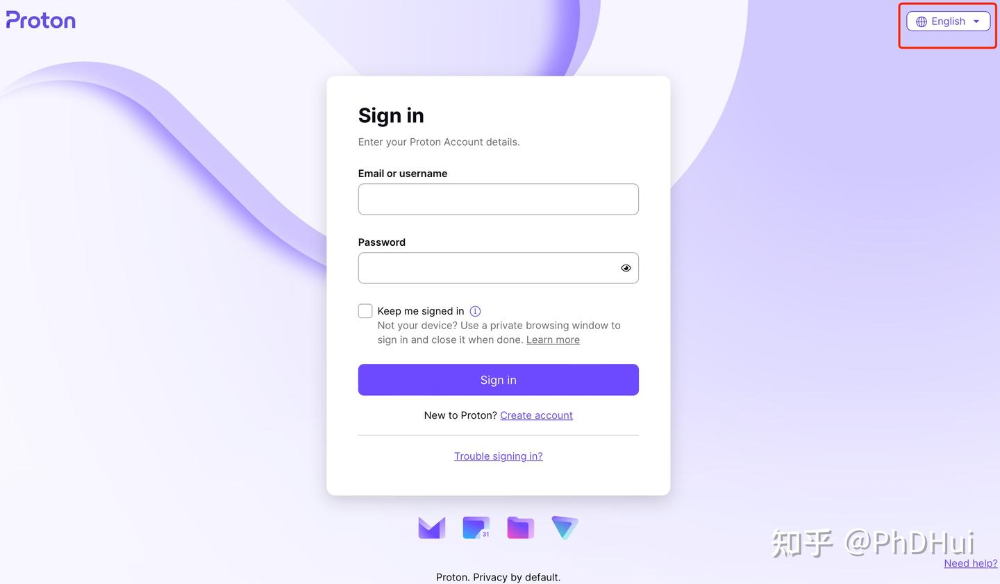

# proton邮箱注册教程

我们推荐Proton邮箱

如果你当初在注册proton VPN时注册过Proton邮箱了，可以跳过。

## 注册

> 基本转自 https://zhuanlan.zhihu.com/p/606700726

(注册网址](https://account.proton.me/mail/signup?plan=free&ref=mail_plus_intro-mailpricing-2)

Proton的登录注册页面，右上角可以切换成中文，点击创建账户。

记清楚你注册的邮箱后缀，点击创建账户，选择注册免费账户。

设置账号用户名密码，通过人机验证即可。

## 登陆

前往[Proton mail](https://mail.proton.me)。登陆即可。

## 绑定邮箱

Proton邮箱不绑定邮箱无法接收其他网站验证码，所以需要绑定邮箱，但既然我们注册Proton是为了安全邮箱，自然没有安全邮箱来绑定，因此我们使用临时邮箱。
**注意保存好你的邮箱密码和用户名，因为没有办法找回。**

我们选择一个提供临时邮箱服务的服务商，推荐[网址](https://yopmail.com/zh/)，进行验证。

> 为什么选择这家的临时邮箱，是因为proton会屏蔽很多临时邮箱的域名，来防止恶意验证，这家会经常更新候补域名。

点击随机地址生成器

前往[账号安全](https://account.proton.me/u/1/mail/recovery)设置密保邮箱。

将新生成的邮箱地址，复制到Proton页面进行验证，点击临时邮箱页面的查看邮箱，查收验证码。

> 在验证的时候，如果遇到Proton页面提示上面红字内容，说明这个邮箱的域名被Proton屏蔽了，换一个即可。

在刚才的临时邮箱页面，选择下方的候补邮箱地址去复制（这里有一列表的邮箱域名，都可以选择），在Proton页面再次进行验证，回到临时邮箱页面，点击查看邮箱，查收验证码。

> 这就是为什么选择这家临时邮箱的原因，它经常会更新候补的邮箱域名，以避免邮箱域名被屏蔽。

